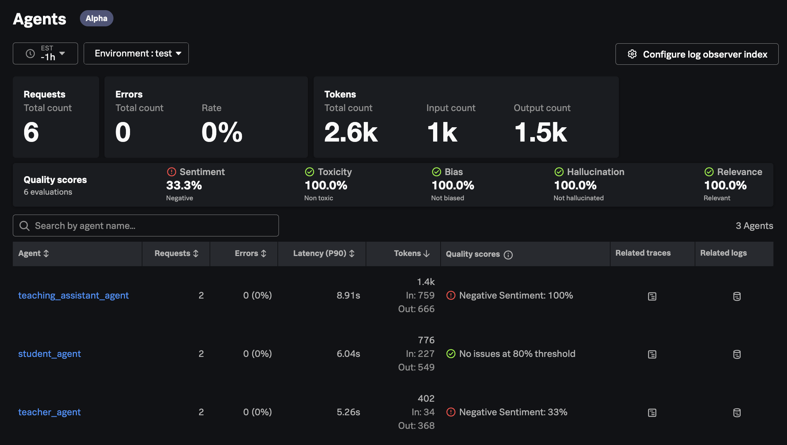
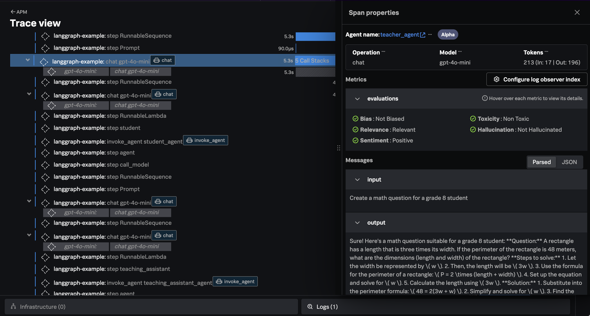
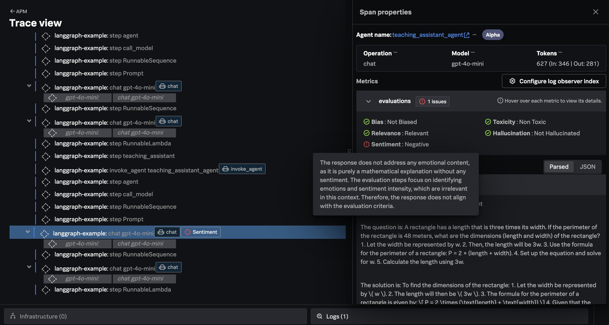

# LangGraph Example with Splunk

This example demonstrates how the
[Splunk Distribution of OpenTelemetry Python](https://help.splunk.com/en/splunk-observability-cloud/manage-data/instrument-back-end-services/instrument-back-end-applications-to-send-spans-to-splunk-apm./instrument-a-python-application/about-splunk-otel-python)
can be used to capture metrics and traces from an application that utilizes 
[LangGraph](https://www.langchain.com/langgraph).

The metrics and traces are sent to an [OpenTelemetry Collector](https://help.splunk.com/en/splunk-observability-cloud/manage-data/splunk-distribution-of-the-opentelemetry-collector/get-started-with-the-splunk-distribution-of-the-opentelemetry-collector),
which exports the data to [Splunk Observability Cloud](https://www.splunk.com/en_us/products/observability-cloud.html).

It uses a sample application with three nodes:

* A teacher, who assigns math problems
* A student, who completes the math assignments
* A teaching assistant, who grades the math assignments

## Prerequisites

* Splunk distribution of OpenTelemetry collector running on the host where the example is deployed
* An OpenAI API key
* Python 3.12
* [uv Package Manager](https://docs.astral.sh/uv/guides/install-python/#installing-a-specific-version)

## Setup the Environment

``` bash
# clone the repo if you haven't already
git clone https://github.com/signalfx/splunk-opentelemetry-examples.git

# navigate to the directory repo
cd splunk-opentelemetry-examples/gen-ai/langgraph/math_problems
```

## Setup the New Project (Optional)

We first installed LangGraph with the following command:

``` bash
# install LangGraph, LangChain, and LangChain OpenAI
uv add langgraph
uv add langchain
uv add langchain_openai
```

We then installed the Splunk Distribution of OpenTelemetry Python, along with packages 
to instrument LangChain and evaluate the semantic quality of responses from the LLM: 

``` bash
uv add splunk-opentelemetry==2.8.0
uv add splunk-otel-instrumentation-langchain==0.1.7
uv add splunk-otel-genai-emitters-splunk==0.1.7
uv add splunk-otel-util-genai==0.1.9
uv add splunk-otel-util-genai-evals==0.1.8
uv add splunk-otel-genai-evals-deepeval==0.1.13
```

Note that there's no need to run these commands a second time, as the code
has already been generated.

## Set Environment Variables

Run the following commands to set environment variables to configure 
OpenTelemetry instrumentation for the application, as well as configure 
how semantic quality of LLM responses will be evaluated: 

``` bash
export OPENAI_API_KEY="REPLACE_WITH_YOUR_KEY_VALUE_HERE"
export OTEL_SERVICE_NAME=langgraph-example
export OTEL_RESOURCE_ATTRIBUTES=deployment.environment=test
export OTEL_EXPORTER_OTLP_ENDPOINT=http://localhost:4317
export OTEL_EXPORTER_OTLP_PROTOCOL=grpc
export OTEL_PYTHON_DISABLED_INSTRUMENTATIONS=click
export OTEL_LOGS_EXPORTER=otlp
export OTEL_PYTHON_LOG_LEVEL=info
export OTEL_PYTHON_LOGGING_AUTO_INSTRUMENTATION_ENABLED=true
export OTEL_EXPORTER_OTLP_METRICS_TEMPORALITY_PREFERENCE="DELTA"
export OTEL_INSTRUMENTATION_GENAI_CAPTURE_MESSAGE_CONTENT="true"
export OTEL_INSTRUMENTATION_GENAI_CAPTURE_MESSAGE_CONTENT_MODE="SPAN_AND_EVENT"
export OTEL_INSTRUMENTATION_GENAI_EVALS_RESULTS_AGGREGATION="true"
export OTEL_INSTRUMENTATION_GENAI_EMITTERS="span_metric_event,splunk"
export OTEL_INSTRUMENTATION_GENAI_EMITTERS_EVALUATION="replace-category:SplunkEvaluationResults"
export OTEL_GENAI_EVAL_DEBUG_SKIPS="true"
export OTEL_GENAI_EVAL_DEBUG_EACH="false"
export OTEL_INSTRUMENTATION_GENAI_DEBUG="false"
export SPLUNK_PROFILER_ENABLED="true"
export DEEPEVAL_PER_ATTEMPT_TIMEOUT_SECONDS_OVERRIDE="300"
export DEEPEVAL_RETRY_MAX_ATTEMPTS="2"
export DEEPEVAL_FILE_SYSTEM="READ_ONLY"
export HOME="/tmp"
```

## Run the Application

Execute the following command to run the application:

``` bash
uv run opentelemetry-instrument python src/app.py
```

## View Data in Splunk Observability Cloud

Splunk Observability Cloud includes a new **Agents** page where you 
can see a summary of how agents are performing, including token usage 
and semantic quality. We can see here that the teaching and teaching 
assistant agents have scored poorly on the sentiment characteristic: 



You should see traces in Splunk Observability Cloud that look like the following. 
In this example, we've selected the `Chat` interaction for the `teacher_agent`, which 
didn't have any quality issues: 



For the `teaching_assistant_agent`, we can see that the quality evaluator 
flagged an issue with sentiment: 


