# Instrumenting a Java Application in Amazon ECS EC2 with AppD Dual Ingest with an ECS Daemon Collector

This example shows how to instrument a Java application running in 
Amazon ECS EC2 with the AppDynamics Java agent. Dual ingest mode is enabled 
to send data to both the AppDynamics controller, as well as an 
OpenTelemetry Collector installed as a separate ECS task running as a Daemon. 
The collector then sends the data to Splunk Observability Cloud. 

This approach lets you maintain full AppDynamics functionality while 
streaming the same telemetry to Splunk Observability Cloud through 
an OpenTelemetry Collector.

## Prerequisites

The following tools are required to build and deploy the Java application and the
Splunk OpenTelemetry Collector:

* Docker
* An AWS account with an ECS cluster and appropriate permissions 
* A Splunk Observability Cloud org with an access token 
* An AppDynamics SaaS tenant 

## Introduction to Amazon ECS

Amazon Elastic Container Service (Amazon ECS) is a managed orchestration service 
that allows you to deploy and scale containerized applications. 

It comes in two flavors: 

* EC2: containers are deployed onto EC2 instances that are provisioned for your ECS cluster
* Fargate: containers are deployed in a serverless manner

We'll demonstrate how to deploy the Java application and OpenTelemetry collector 
using ECS EC2.

## Deploy the Collector

First, let's deploy the OpenTelemetry collector running as an ECS Daemon service. 

### Create the Task Definition 

Refer to the [collector-task-definition.json](./collector-task-definition.json) file 
as an example, which includes a container with the Splunk distribution of the 
OpenTelemetry Collector. 

Update the [collector-task-definition.json](./collector-task-definition.json) file to set the 
target Splunk Observability Cloud realm and access token: 

````
   "name": "splunk-otel-collector",
   "image": "quay.io/signalfx/splunk-otel-collector:latest",
   "cpu": 0,
   "portMappings": [],
   "essential": true,
   "environment": [
       {
           "name": "SPLUNK_CONFIG",
           "value": "/etc/otel/collector/ecs_ec2_config.yaml"
       },
       {
           "name": "SPLUNK_REALM",
           "value": "<Realm - us0, us1, etc>"
       },
       {
           "name": "SPLUNK_ACCESS_TOKEN",
           "value": "<Access Token>"
       },
       {
           "name": "ECS_METADATA_EXCLUDED_IMAGES",
           "value": "[\"quay.io/signalfx/splunk-otel-collector:latest\"]"
       }
````

Note that this task uses `host` networking mode, to ensure it's accessible using the 
private IP address of the underlying EC2 instance. 

We have what we need now to deploy our collector task definition to Amazon ECS.

So navigate to the AWS console and go to the Amazon Elastic Container Service page.  Assuming
that you've already got an ECS EC2 cluster setup, click on Task definitions and then
`Create a new task definition` from JSON.  Copy and paste the `collector-task-definition.json` file as
in the following screenshot:

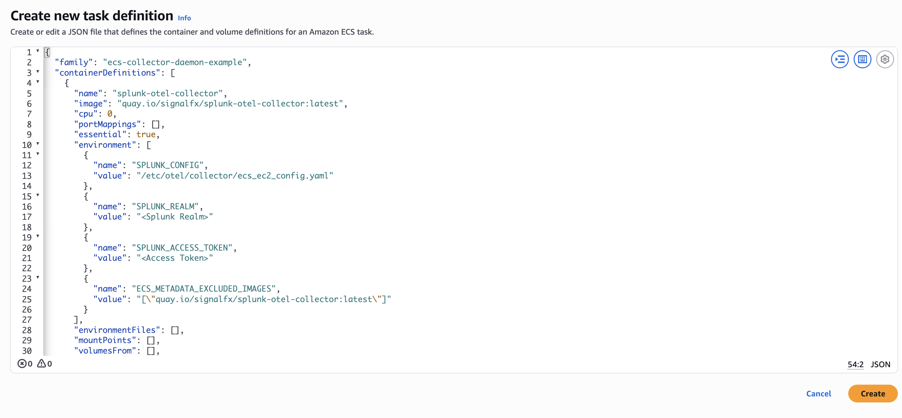

Once the task definition is created successfully, navigate to the ECS EC2 cluster
where you'd like to deploy the application, then create a new service:

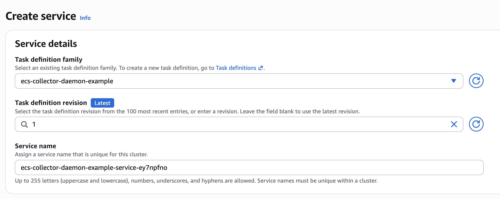

Specify "EC2" as the launch type:

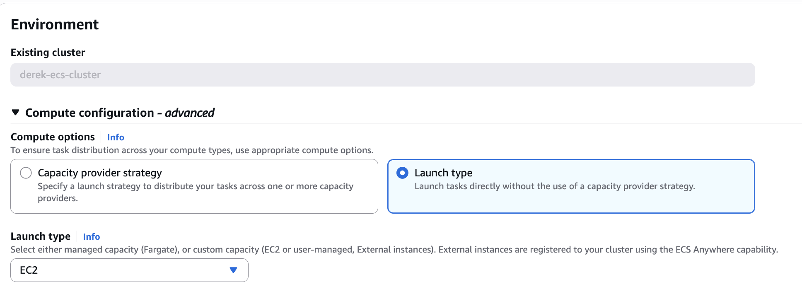

Select "Daemon" as the scheduling strategy: 

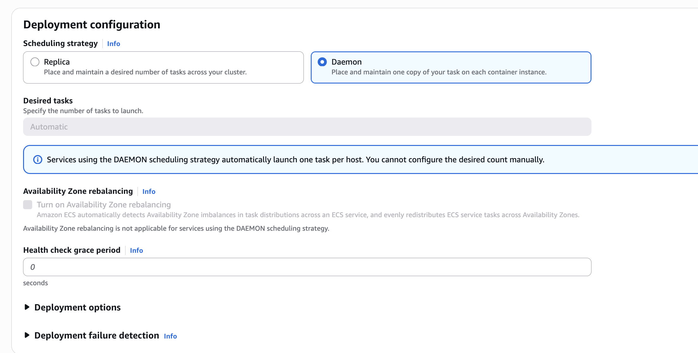

It will take a few minutes to deploy the service.  But once it's up and running,
it should look like this in the AWS console:

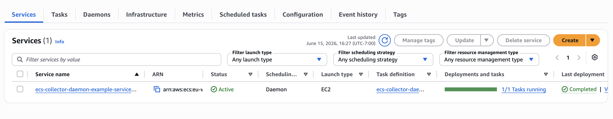


## Prepare the Application Image 

We used the following steps to build a Docker image for the 
example application.

### Build the Docker image (optional)

To run the application in ECS, we'll need a Docker image for the application.
We've already built one, so feel free to skip this section unless you want to use
your own image.

You can use the following command to build the Docker image:

````
docker build --platform="linux/amd64" -t appd-dual-ingest-daemon-collector:1.0 app
````

Note that the [Dockerfile](./app/Dockerfile) adds the latest version of the AppD Java agent
to the container image, and then includes it as part of the java startup
command when the container is launched. 

The `Dockerfile` also ensures `curl` is installed in the final container: 

```Dockerfile
RUN apk add --no-cache curl
```

This solution includes an application startup script named `start.sh`, which is 
added to the final container as follows:

```Dockerfile
COPY start.sh /app/start.sh
RUN chmod +x /app/start.sh 
```

The entry point for the application Docker image simply runs the `start.sh` script: 

```Dockerfile
ENTRYPOINT ["/app/start.sh"]
```

The purpose of the `start.sh` script is to determine which IP address to use 
to connect to the OpenTelemetry collector. The logic is as follows: 

```bash
TOKEN=$(curl -s -X PUT "http://169.254.169.254/latest/api/token" \
  -H "X-aws-ec2-metadata-token-ttl-seconds: 21600")

HOST_IP=$(curl -s -H "X-aws-ec2-metadata-token: $TOKEN" \
  http://169.254.169.254/latest/meta-data/local-ipv4)

export OTEL_EXPORTER_OTLP_ENDPOINT="http://${HOST_IP}:4318"
```

The `start.sh` script then starts the application, referencing environment variables set 
in the task definition to set the AppDynamics host name, application name, tier name, and 
node name. The OpenTelemetry resource attributes are also set in the command. 

```bash
exec java \
  -javaagent:/app/agent/javaagent.jar \
  -Dappdynamics.controller.hostName="${APPD_CONTROLLER_HOST}" \
  -Dappdynamics.controller.port=443 \
  -Dappdynamics.controller.ssl.enabled=true \
  -Dappdynamics.agent.applicationName="${APPD_APP_NAME}" \
  -Dappdynamics.agent.tierName="${APPD_TIER_NAME}" \
  -Dappdynamics.agent.nodeName="${APPD_NODE_NAME}" \
  -Dappdynamics.agent.accountName="${APPD_ACCOUNT_NAME}" \
  -Dappdynamics.agent.accountAccessKey="${APPD_ACCESS_KEY}" \
  -Dagent.deployment.mode=dual \
  -Dotel.traces.exporter=otlp \
  -Dotel.exporter.otlp.endpoint="${OTEL_EXPORTER_OTLP_ENDPOINT}" \
  -Dotel.service.name="${OTEL_SERVICE_NAME}" \
  -Dotel.resource.attributes="${OTEL_RESOURCE_ATTRIBUTES}" \
  -jar /app/app.jar
```

### Push the Docker image (optional)

We'll then need to push the Docker image to a repository that you have
access to, such as your Docker Hub account.  We've already done this for you,
so feel free to skip this step unless you'd like to use your own image.

Specifically, we've pushed the
image to GitHub's container repository using the following commands:

````
docker tag appd-dual-ingest-daemon-collector:1.0 ghcr.io/splunk/appd-dual-ingest-daemon-collector:1.0
docker push ghcr.io/splunk/appd-dual-ingest-daemon-collector:1.0
````

## Update the ECS Task Definition 

The next step is to create the ECS Task definition for our application. 

For our application container, we first need to add several environment variables: 

````
   "environment": [
       {
           "name": "APPD_APP_NAME",
           "value": "aws-ecs-appd-dual-ingest-example"
       },
       {
           "name": "APPD_TIER_NAME",
           "value": "OrderService"
       },
       {
           "name": "APPD_NODE_NAME",
           "value": "OrderService-Node"
       },       {
           "name": "APPD_CONTROLLER_HOST",
           "value": "your_appd_controller_host"
       },
       {
           "name": "APPD_ACCOUNT_NAME",
           "value": "your_appd_account_name"
       },
       {
           "name": "APPD_ACCESS_KEY",
           "value": "your_appd_access_key"
       },
       {
            "name": "OTEL_SERVICE_NAME",
            "value": "OrderService"
       },
       {
           "name": "OTEL_RESOURCE_ATTRIBUTES",
           "value": "service.namespaceaws-ecs-appd-dual-ingest-example,deployment.environment=aws-ecs-appd-dual-ingest-example,deployment.environment.name=aws-ecs-appd-dual-ingest-example"
       }
   ],
````

We've prepared a [app-task-definition.json](./app-task-definition.json) file that you can 
use as an example.  Open this file for editing, and replace the: 

* \<AppD Controller Host\>
* \<AppD Account Name\>
* \<AppD Access Key\>
* \<AWS Region\>
* \<AWS Account ID\>

placeholders with appropriate values for your environment. 

## Deploy to Amazon ECS 

We have what we need now to deploy our application task definition to Amazon ECS. 

So navigate to the AWS console and go to the Amazon Elastic Container Service page.  Assuming
that you've already got an ECS cluster setup, click on Task definitions and then 
Create a new task definition from JSON.  Copy and paste your task-definition.json file as
in the following screenshot: 

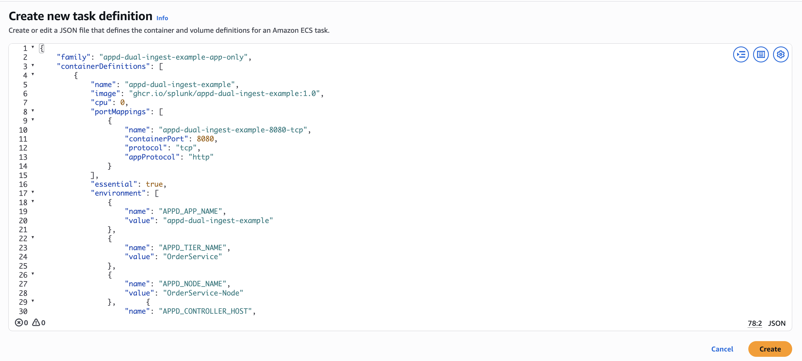

Once the task definition is created successfully, navigate to the ECS cluster 
where you'd like to deploy the application, then create a new service:

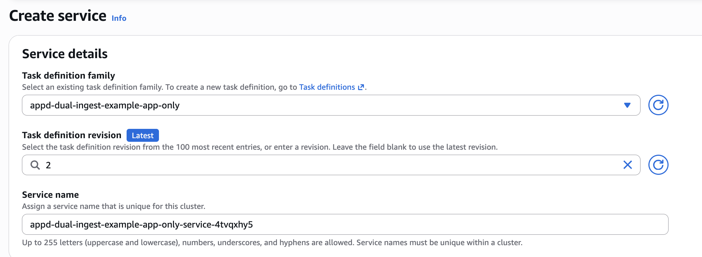

Specify "EC2" as the launch type: 

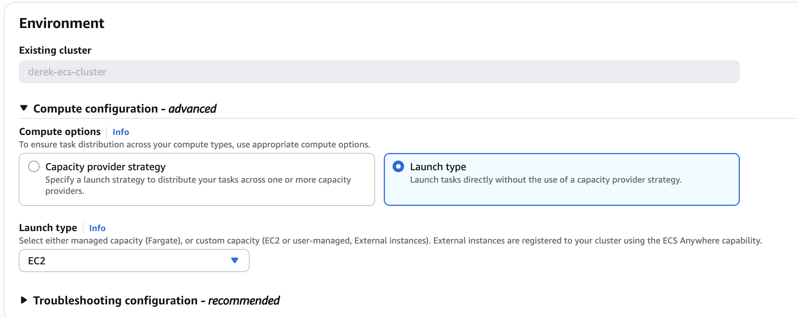

Specify "Replica" as the scheduling strategy:

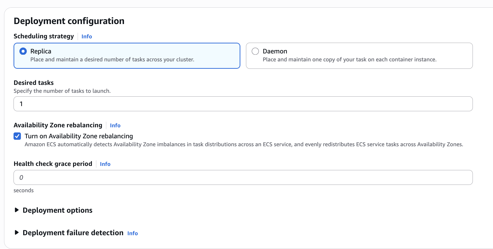

It will take a few minutes to deploy the service.  But once it's up and running, 
it should look like this in the AWS console: 

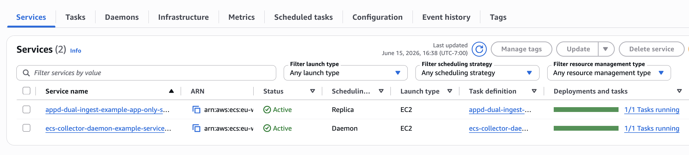

For a production application, we'd want to put a load balancer in front of 
the ECS application service. But for a quick test, I'm going to ssh into 
the EC2 instance where the ECS application container is running. 

Then I'm going to find the container ID as follows: 

```bash
docker ps | grep start.sh
e904bb8df1c0   ghcr.io/splunk/appd-dual-ingest-daemon-collector:1.0   "/app/start.sh"   3 minutes ago       Up 3 minutes                           ecs-appd-dual-ingest-example-app-only-6-appd-dual-ingest-example-82fcc3aaacfdeeacee01
```

Then I'm going to shell into that container as follows: 

```bash
docker exec -it e904bb8df1c0 sh
```

Then run the following commands a few times to generate application load: 

```bash
curl -s http://localhost:8080/order
curl -s http://localhost:8080/inventory/check
```

## View APM Data in AppDynamics

Open the AppDynamics UI, and search for the application named 
`aws-ecs-appd-dual-ingest-example`: 


When you open the application, the flow map should look like the following: 

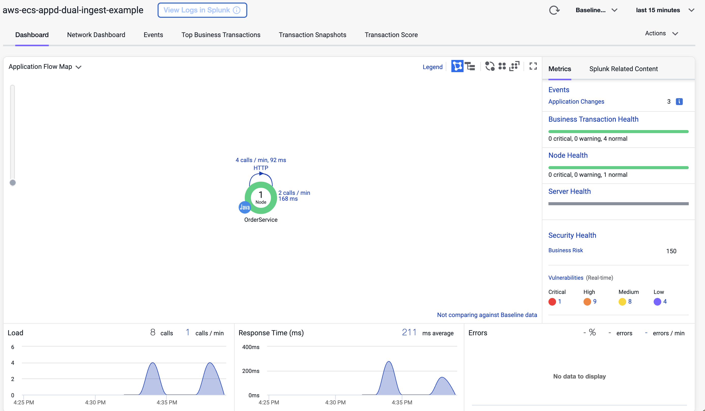

You should see several business transactions, such as `/order` and `/inventory/check`:


## View Traces in Splunk Observability Cloud

Next, open the Observability Cloud UI. Navigate to `APM` -> `Overview` and filter 
on the environment named `aws-ecs-appd-dual-ingest-example`:

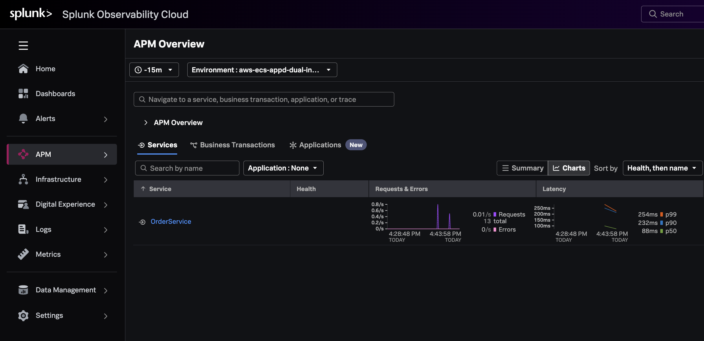

Then, click on the `Business Transactions` tab. You'll see the same business transactions 
we saw earlier in AppD: 

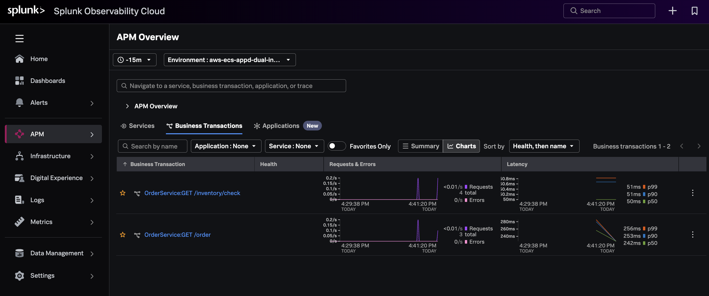

Next, click on traces and select one of the traces for `GET /order`:


Note that the trace has been decorated with Kubernetes attributes, such as `aws.ecs.cluster.arn`.  
This allows us to retain context when we navigate from APM to
infrastructure data within Splunk Observability Cloud. 

## View Log Data

To ensure the trace and span id are included with each log entry, the following 
packages were included in the [pom.xml](app/pom.xml) file: 

```xml
        <dependency>
            <groupId>org.springframework.boot</groupId>
            <artifactId>spring-boot-starter-log4j2</artifactId>
        </dependency>
        <dependency>
            <groupId>io.opentelemetry.instrumentation</groupId>
            <artifactId>opentelemetry-log4j-context-data-2.17-autoconfigure</artifactId>
            <version>${opentelemetry-instrumentation.version}</version>
            <scope>runtime</scope>
        </dependency>
```

And the trace information is included in the [log4j2.xml](app/src/resources/log4j2.xml) file: 

```xml
<?xml version="1.0" encoding="UTF-8"?>
<Configuration status="WARN">
    <Appenders>
        <Console name="Console" target="SYSTEM_OUT">
            <PatternLayout pattern="%d{HH:mm:ss.SSS} %-5level [%t] %c{1} - trace_id=%X{trace_id} span_id=%X{span_id} trace_flags=%X{trace_flags} service.name=${env:OTEL_SERVICE_NAME} %m%n"/>
        </Console>
    </Appenders>
    <Loggers>
        <Root level="info">
            <AppenderRef ref="Console"/>
        </Root>
    </Loggers>
</Configuration>
```

In CloudWatch, we can see that log entries include the trace information: 

````
21:21:04.717 INFO [http-nio-8080-exec-4] InventoryController - trace_id=08f56590354ae2146d7ea515bfdd139f span_id=145401b79715fdc9 trace_flags=03 service.name=OrderService Checking inventory availability
21:21:05.103 INFO [http-nio-8080-exec-5] PaymentController - trace_id=08f56590354ae2146d7ea515bfdd139f span_id=8bb911030811ce32 trace_flags=03 service.name=OrderService Payment processed with result: approved
````